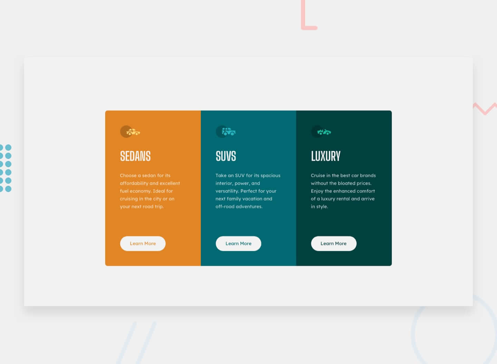

# Frontend Mentor - Challenges

<!-- > **_Status:_** Em andamento :construction: -->
<!-- > **_Status:_** Finalizado :heavy_check_mark: -->

## Descrição

Repositorio para listar as soluções desenvolvidas para os desafios de [frontend mentor](https://www.frontendmentor.io/challenges/).

<!--
| Desafio | Preview | Status| Repo Link | Site Link |
|:--:|:--:|:--:|:--:|:--:|
| Name | img | statusMark | RepoLink | SiteLink | -->

| Desafio | Preview | Status| Repo Link | Site Link |
|:--:|:--:|:--:|:--:|:--:|
| 3-column-preview-card-component |  | :heavy_check_mark: | [RepoLink](https://github.com/filiphis/portfolio/tree/main/3-column-preview-card-component) | [SiteLink](https://3-column-preview-card-component-hazel.vercel.app/) |

<!-- | [3-column-preview-card-component](https://github.com/filiphis/front-end-challenges/tree/master/challenge01) |  | :white_check_mark: | [Repo Link](3-column-preview-card-component) | [Site Link](https://filiphis.github.io/3-column-preview-card-component/) | -->

:star: By ** Luiz Silveira ** :star:
### Contato:

 
