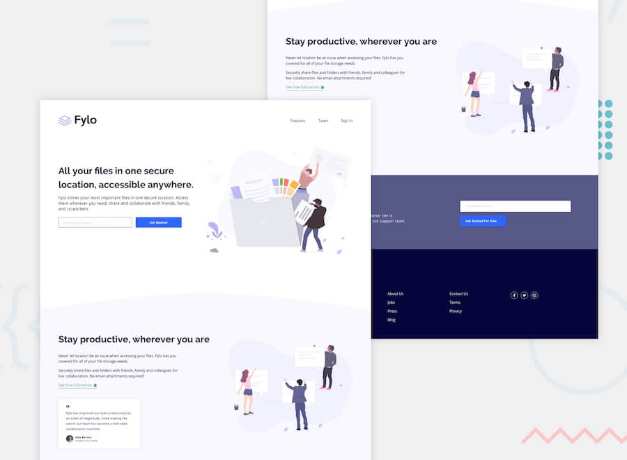

# Frontend Mentor - Challenges

<!-- > **_Status:_** Em andamento :construction: -->
<!-- > **_Status:_** Finalizado :heavy_check_mark: -->

Visualize as soluções em: https://portfolio-six-flax.vercel.app/

## Descrição

Repositorio para listar as soluções desenvolvidas para os desafios de [frontend mentor](https://www.frontendmentor.io/challenges/).

<!--
| Desafio | Preview | Status| Repo Link | Site Link |
|:--:|:--:|:--:|:--:|:--:|
| Name | img | statusMark | RepoLink | SiteLink | -->

| Desafio | Preview | Status| Repo Link | Site Link |
|:--:|:--:|:--:|:--:|:--:|
| 3-column-preview-card-component |  | :heavy_check_mark: | [Repo](https://github.com/filiphis/portfolio/tree/main/3-column-preview-card-component) | [Site](https://filiphis.github.io/portfolio/3-column-preview-card-component/) |
| profile-card-component |  | :heavy_check_mark: | [Repo](https://github.com/filiphis/portfolio/tree/main/profile-card-component) | [Site](https://filiphis.github.io/portfolio/profile-card-component/) |
| stats-preview-card-component |  | :heavy_check_mark: | [Repo](https://github.com/filiphis/portfolio/tree/main/stats-preview-card-component) | [Site](https://filiphis.github.io/portfolio/stats-preview-card-component/) |
| single-price-grid-component |  | :heavy_check_mark: | [Repo](https://github.com/filiphis/portfolio/tree/main/single-price-grid-component) | [Site](https://filiphis.github.io/portfolio/single-price-grid-component/) |
| fylo-landing-page-with-two-column-layout-master |  | :heavy_check_mark: | [Repo](https://github.com/filiphis/portfolio/tree/main/fylo-landing-page-with-two-column-layout-master) | [Site](https://filiphis.github.io/portfolio/fylo-landing-page-with-two-column-layout-master/) |
| faq-accordion-card |  | :heavy_check_mark: | [Repo](https://github.com/filiphis/portfolio/tree/main/faq-accordion-card) | [Site](https://filiphis.github.io/portfolio/faq-accordion-card/) |
| social-proof-section |  | :heavy_check_mark: | [Repo](https://github.com/filiphis/portfolio/tree/main/social-proof-section) | [Site](https://filiphis.github.io/portfolio/social-proof-section/) |
| article-preview-component |  | :heavy_check_mark: | [Repo](https://github.com/filiphis/portfolio/tree/main/article-preview-component) | [Site](https://filiphis.github.io/portfolio/article-preview-component/) |

<!-- | [3-column-preview-card-component](https://github.com/filiphis/front-end-challenges/tree/master/challenge01) |  | :white_check_mark: | [Repo Link](3-column-preview-card-component) | [Site Link](https://filiphis.github.io/3-column-preview-card-component/) | -->

## Autor

:star: By **_Luiz Silveira_** :star:
### Contato:

 

